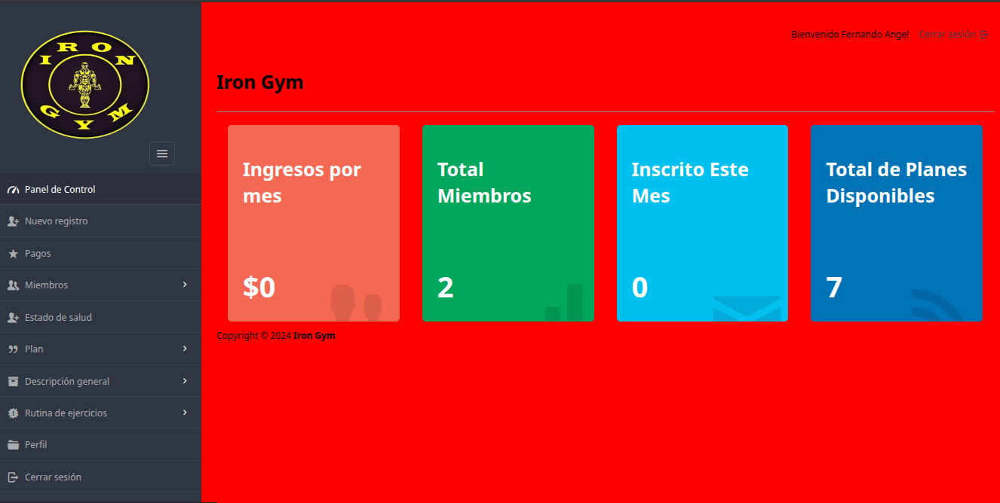
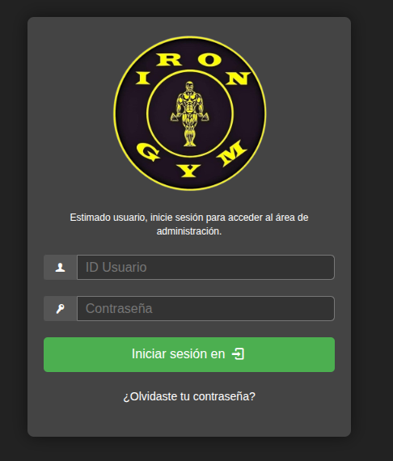

# 🏋️ Gymiro - Sistema de Gestión para Gimnasios

[](https://php.net)
[](https://mysql.com)
[](https://getbootstrap.com)
[](LICENSE)

## 📋 Descripción

**Gymiro** es un sistema de gestión integral para gimnasios diseñado para facilitar la administración de membresías, usuarios, entrenadores y horarios. Construido con **PHP** y **MySQL/MariaDB**, este proyecto ofrece una interfaz web intuitiva y responsiva para gestionar las operaciones diarias de un gimnasio de manera eficiente y centralizada.

La plataforma permite registrar usuarios, gestionar pagos, programar clases y generar reportes detallados, todo desde una interfaz moderna y fácil de usar.

## 🖼️ Vista del Proyecto


### Login


<!-- Para agregar una imagen, súbela a tu repositorio y reemplaza "assets/screenshot.png" con la ruta real -->

## ✨ Características

- 👥 **Gestión de Usuarios**: Registro, edición y eliminación de miembros y entrenadores
- 💳 **Control de Membresías**: Seguimiento de suscripciones, pagos y renovaciones
- 📅 **Programación de Clases**: Creación y gestión de horarios para clases grupales e individuales
- 📊 **Reportes Detallados**: Generación de reportes sobre asistencia, ingresos y estadísticas
- 📱 **Interfaz Responsiva**: Diseño adaptado para dispositivos móviles y de escritorio
- 🔒 **Base de Datos Segura**: Uso de MySQL/MariaDB para almacenamiento eficiente y seguro

## 🛠️ Tecnologías Utilizadas

### Backend
- **PHP 8.4+** - Lenguaje de programación principal
- **MySQL/MariaDB 8.0+** - Sistema de gestión de base de datos

### Frontend
- **HTML5, CSS3, JavaScript** - Tecnologías web fundamentales
- **Bootstrap 5.x** - Framework CSS para diseño responsivo

### Base de Datos
- **MySQL/MariaDB** - Esquema definido en `gymiron.sql`

### Herramientas de Desarrollo
- **Servidor PHP integrado** - Para desarrollo local
- **Git** - Control de versiones

## 📁 Estructura del Proyecto

```
gymiro/
├── gymiron.sql           # Script SQL para crear la base de datos gymhuella
├── index.php             # Archivo principal de la aplicación
├── config.php            # Configuración de base de datos
├── assets/               # Recursos estáticos
│   ├── css/             # Archivos de estilos
│   ├── js/              # Scripts JavaScript
│   └── img/             # Imágenes
├── includes/             # Archivos PHP incluidos
└── README.md            # Este archivo
```

## 🚀 Instalación

### Prerrequisitos
- **PHP 8.4+**
- **MySQL/MariaDB 8.0+**
- **Git**
- **Servidor web** (Apache/Nginx o servidor integrado de PHP)

### Pasos de instalación

1. **Clona el repositorio:**
   ```bash
   git clone https://github.com/FERNANDOANGEL202123767/gymiro.git
   cd gymiro
   ```

2. **Configura la base de datos:**
   ```bash
   # Para MySQL
   mysql -u root -p
   CREATE DATABASE gymhuella;
   exit
   mysql -u root -p gymhuella < gymiron.sql
   
   # Para MariaDB
   mariadb -u root -p
   CREATE DATABASE gymhuella;
   exit
   mariadb -u root -p gymhuella < gymiron.sql
   ```

3. **Configura las credenciales:**
   ```php
   // Edita config.php con tus credenciales
   <?php
   define('DB_HOST', 'localhost');
   define('DB_USER', 'root');
   define('DB_PASS', 'tu_contraseña');
   define('DB_NAME', 'gymhuella');
   ?>
   ```

4. **Inicia el servidor:**
   ```bash
   php -S localhost:8000
   ```

5. **Accede a la aplicación:**
   Abre tu navegador en: `http://localhost:8000`

## 📖 Uso

### 🔐 Acceso al Sistema
- Navega a `http://localhost:8000`
- Usa las credenciales predeterminadas o registra un nuevo usuario admin

### 👥 Gestión de Usuarios
- **Miembros**: Registra nuevos miembros, actualiza información personal y gestiona estados de membresía
- **Entrenadores**: Administra el personal, asigna especializaciones y horarios

### 💳 Control de Membresías
- **Suscripciones**: Crea diferentes tipos de membresías con precios y duraciones
- **Pagos**: Registra pagos, genera recibos y controla vencimientos
- **Renovaciones**: Gestiona renovaciones automáticas y manuales

### 📅 Programación de Clases
- **Horarios**: Crea horarios flexibles para clases grupales
- **Asignaciones**: Asigna entrenadores específicos a cada clase
- **Capacidad**: Controla el número máximo de participantes

### 📊 Reportes y Estadísticas
- **Asistencia**: Monitorea la asistencia de miembros y clases
- **Ingresos**: Genera reportes financieros mensuales y anuales
- **Membresías**: Analiza tendencias de suscripciones y cancelaciones

## ⚙️ Configuración Avanzada

### Servidor Web Alternativo
Para usar **Apache** o **Nginx**:
1. Configura el virtual host apuntando al directorio `gymiro`
2. Habilita el módulo PHP
3. Configura permisos de lectura/escritura

### Optimización de Base de Datos
```sql
-- Optimizaciones recomendadas
CREATE INDEX idx_member_email ON members(email);
CREATE INDEX idx_payment_date ON payments(payment_date);
CREATE INDEX idx_class_schedule ON classes(start_time, end_time);
```

## 🔧 Solución de Problemas

### Error de Conexión a Base de Datos
```bash
# Verifica que el servicio esté corriendo
sudo systemctl status mysql
sudo systemctl start mysql
```

### Error 404 en localhost:8000
- Confirma que estás en el directorio correcto
- Verifica que `index.php` existe
- Revisa los permisos de archivos

### Comando MySQL Deprecated
```bash
# Usa mariadb si mysql está obsoleto
mariadb -u root -p gymhuella < gymiron.sql
```

## 🤝 Contribuir

¡Las contribuciones son bienvenidas! Para contribuir:

1. **Fork** el repositorio
2. Crea una nueva rama (`git checkout -b feature/nueva-funcionalidad`)
3. Realiza tus cambios siguiendo **PSR-12**
4. Haz commit con mensajes descriptivos (`git commit -m "Añade gestión de inventario"`)
5. Sube los cambios (`git push origin feature/nueva-funcionalidad`)
6. Abre un **Pull Request**

### Convenciones de Código
- Sigue los estándares **PSR-12** para PHP
- Documenta funciones y clases
- Incluye pruebas para nuevas funcionalidades
- Mantén consistencia en el estilo de código

## 📄 Licencia

Este proyecto está bajo la [Licencia MIT](LICENSE).

## 📧 Contacto

**GitHub:** [FERNANDOANGEL202123767](https://github.com/FERNANDOANGEL202123767)

---

## 🙏 Agradecimientos

- A la comunidad de código abierto por **PHP**, **MySQL** y **Bootstrap**
- A los desarrolladores de **MariaDB** por una excelente alternativa a MySQL
- A todos los contribuyentes que hacen posible este proyecto

---

🏋️ **¡Gestiona tu gimnasio de manera eficiente con Gymiro!** 🏋️
